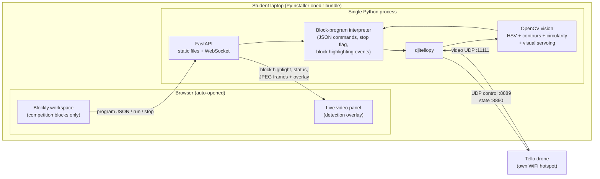

# COMP1 Platform Architecture — Options, Comparison, and Decision

**Status:** Decided (pending items listed at the end) · **Date:** 2026-07-28

This document resolves §3.3 ("Platform Architecture — still under consideration") of the Competition 1 requirements. It compares the two candidate frontends, surveys off-the-shelf alternatives, evaluates delivery/packaging options, and records a recommended architecture with rationale.

---

## 1. The constraint that decides most of it

The competition's core blocks — **"detect red circular marker"** and **"approach and stop in front of marker"** — require a custom OpenCV pipeline (HSV thresholding + contour/circularity analysis + visual servoing) running against the Tello's live video stream. That single requirement eliminates most existing products:

| Alternative surveyed | Tello flight blocks | Custom vision pipeline | Verdict |
|---|---|---|---|
| [DroneBlocks](https://learn.droneblocks.io/p/introduction-to-tello-edu-drone-programming-with-droneblocks) (iOS/Android/Chrome) | ✅ Mature | ❌ No custom CV injection | Rejected — keep as **UX reference** for block design |
| Tello EDU app (official) | ✅ | ❌ | Rejected |
| Scratch 2/3 + Tello extension | ✅ | ❌ | Rejected |
| mBlock 5 | ✅ | ❌ (extensions target cloud AI services, not local OpenCV) | Rejected |
| Node-RED + Tello nodes | Flow-based, not kid block-coding | ❌ | Rejected |
| [BIPES](http://www.bipes.net.br/source.html) / M5Stack UIFlow | UIFlow has Tello blocks | ❌ (MicroPython/embedded focus) | Rejected |

**Conclusion:** a local Python backend (djitellopy + OpenCV) is unavoidable. Browsers cannot open raw UDP sockets, so *any* browser-based frontend needs this local bridge process — the requirements doc's reasoning holds. The real decision is therefore the **frontend** and the **packaging**, not the backend.

---

## 2. Frontend comparison

### Option A — Custom standalone Blockly web app ✅ RECOMMENDED

A single-page web app built directly on the [Blockly](https://github.com/google/blockly) library, served by the Python backend itself.

**For:**

- The toolbox contains **only** the ~15 competition blocks from requirements §2 — no menus, cells, or kernels to confuse first-time coders. Full control over a kid-friendly, kiosk-like UI.
- Blockly is a plain, vendorable JS library — trivially bundled for **fully offline** use (required: the laptop loses internet once joined to the Tello's WiFi hotspot).
- One Python process serves the static frontend, the WebSocket, drone control, and vision — one process, one executable.
- Blockly was transferred from Google to the **Raspberry Pi Foundation (Nov 2025)** and remains actively maintained under Apache-2.0.

**Against:**

- More frontend code to write than reusing an existing shell: run/stop controls, block highlighting, status console. (Mitigated: this is standard Blockly usage with abundant examples.)

**Execution model (key design choice):** Blockly should generate a **JSON command program that the backend interprets step-by-step**, rather than generating raw Python for `exec()`. This gives:

- currently-executing-block **highlighting** in the workspace,
- **instant emergency stop** mid-program (interpreter checks a stop flag between steps),
- no arbitrary-code-execution surface,
- and it naturally prevents the anti-hardcoding concern (§4): only blocks that exist can be expressed — there is no "fly to coordinate" escape hatch.

### Option B — JupyterLab + jupyterlab-blockly ❌ Rejected

- Custom blocks **are** supported via [`IBlocklyRegistry`](https://jupyterlab-blockly.readthedocs.io/en/latest/other_extensions.html) — but registering them requires writing a JupyterLab **TypeScript extension anyway**, so there is no development-effort saving over Option A.
- The extension is at **v0.3.x**; long-term compatibility with current JupyterLab releases is a risk we'd carry to competition day.
- JupyterLab's UI (notebook cells, kernels, file browser, menus) is exactly the overhead the requirements flag as a concern for younger, first-time-coder students, and locking it down means fighting the framework.
- Packaging JupyterLab with PyInstaller is notoriously fragile (labextension data files, entry points).

### Option C — Off-the-shelf apps ❌ Rejected

See §1. None can host the custom vision pipeline that is the heart of the competition.

---

## 3. Delivery / packaging comparison

| Option | Verdict | Reasoning |
|---|---|---|
| **PyInstaller, onedir, auto-open system browser** | ✅ **Recommended** | The Jupyter/OctoPrint pattern named in the requirements. Mature community hooks for `cv2`/`numpy`. `onedir` over `onefile`: faster startup, and on-venue failures are debuggable (files are inspectable). Build per-OS (Windows and macOS builds each produced on that OS). |
| pywebview native window | ⏸ Deferred, not primary | Near-zero extra weight and more kiosk-like — but it binds the frontend to the desktop process. Keeping the frontend purely browser-served preserves the Chromebook thin-client path (§4). Can be added later with **no architecture change**. |
| Electron / Tauri + Python sidecar | ❌ Rejected | Adds a Node and/or Rust toolchain and a second runtime to maintain, for no functional gain over a browser tab. |
| Nuitka | ❌ Rejected | Slower builds and fewer prebuilt hooks for `cv2`/`numpy` than PyInstaller; no benefit that matters here. |

**Offline requirement:** fully achievable under the recommendation — vendor Blockly and all JS/CSS/fonts into the served static directory; zero CDN references. This should be enforced with a build-time check (grep the bundle for `http(s)://`).

---

## 4. Chromebook contingency ⚠️

Target OS is not yet final — possibly **Windows + macOS + Chromebook**. Chromebook changes the calculus:

- A PyInstaller executable **cannot run on ChromeOS**. Linux mode (Crostini) can run Python, but school-managed Chromebooks frequently have it disabled by policy.
- Because the recommended frontend is **pure browser**, a **hub deployment** remains possible: the Python backend runs on one bridging device — an instructor laptop or a Raspberry Pi — whose WiFi joins the Tello hotspot, while Chromebooks connect to the backend as thin clients over a second interface (Ethernet/LAN or the Pi's second radio). This is a deployment change only, not an architecture change — which is itself an argument for Option A over any desktop-shell approach.

**To confirm with schools/organisers:**

1. Are Chromebooks actually required, or only Windows/macOS?
2. If required: is Crostini enabled on the managed devices?
3. If not: is one bridge device (laptop/Pi) per team acceptable?

---

## 5. Recommended architecture

**Custom Blockly web frontend + single local Python service (FastAPI + djitellopy + OpenCV over WebSocket) + PyInstaller onedir bundle that auto-opens the browser; all assets vendored for offline use; hub deployment as the Chromebook fallback.**

Data flow notes:

- **Video:** backend decodes the Tello H.264 stream (djitellopy), runs detection, draws the overlay server-side, and pushes JPEG frames over the WebSocket. The student always sees what the drone sees and *why* detection fired or missed — essential for on-venue HSV tuning (§3.1 of the requirements).
- **Program execution:** frontend sends the block program as JSON; the backend interpreter executes it step-by-step, emitting "now executing block X" events (workspace highlighting) and honouring the emergency-stop flag between every step.
- **Emergency stop:** a dedicated UI button sends a WebSocket message handled outside the interpreter loop → immediate `emergency`/`land`.

## 6. Answers to §3.3 "still needs research" items

| Open item in requirements | Answer |
|---|---|
| Can jupyterlab-blockly be customised without exposing JupyterLab overhead? | Technically yes (`IBlocklyRegistry`), but it needs a TS extension anyway and can't hide enough UI — rejected (§2B). |
| Cross-platform packaging behaviour | PyInstaller onedir, built per-OS for Windows/macOS. Chromebook cannot run it → hub deployment (§4). |
| Single bundled app vs separate components | Single bundle: one Python process serves frontend + WebSocket + control + vision. |
| Can all frontend assets be bundled offline? | Yes — vendor Blockly/JS/CSS/fonts locally; enforce no-CDN with a build check (§3). |

## 7. Remaining open items (outside this decision)

- Chromebook confirmation questions (§4).
- Organiser confirmation on the "safe distance" judging threshold (requirements §3.2) — affects which monocular distance approach the "approach and stop" block uses; the architecture supports either.
- Mission-pad "return to start" (requirements §3.4) — a backend/blocks feature decision, independent of platform architecture; note the §4 anti-hardcoding requirement that any mission-pad block must not be repurposable to skip the search phase.
- On-site HSV re-tuning workflow (requirements §3.1/§4) — the live overlay panel in this architecture is the enabling tool; a simple threshold-slider debug panel is a candidate follow-up feature.

## Sources

- [jupyterlab-blockly — extending with custom blocks](https://jupyterlab-blockly.readthedocs.io/en/latest/other_extensions.html) · [QuantStack/jupyterlab-blockly](https://github.com/QuantStack/jupyterlab-blockly) · [PyPI](https://pypi.org/project/jupyterlab-blockly/)
- [Blockly developer site (Raspberry Pi Foundation transfer, Nov 2025)](https://developers.google.com/blockly)
- [DJITelloPy](https://github.com/damiafuentes/DJITelloPy)
- [DroneBlocks curriculum](https://learn.droneblocks.io/p/introduction-to-tello-edu-drone-programming-with-droneblocks) · [DroneBlocks + Tello EDU overview](https://www.eduporium.com/blog/tips-tricks-droneblocks/)
- [BIPES](http://www.bipes.net.br/source.html)
- [pywebview vs Electron (2025)](https://johal.in/pywebview-python-tiny-electron-cef-alternative-cross-platform-2025/) · [Tauri overview](https://en.wikipedia.org/wiki/Tauri_(software_framework))
